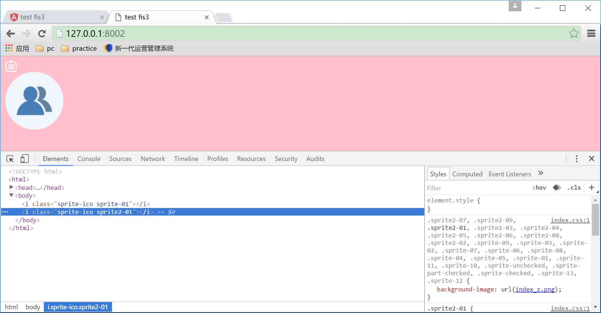

为检测是不是fis loader的allInOne引起的雪碧图合并失败，而进行控制变量法演示的demo

## 当启用`allInOne`配置时

运行`npm run build.lc`，打开页面<http://127.0.0.1:8001/>可看到雪碧图无法被合并


## 当注释`allInOne`配置时

运行`npm run build.lc2`，打开页面可看到雪碧图已被合并为index_z.png了



## conclusion

```js
fis
  .match("::package", {
    postpackager: [
      fis.plugin('loader', {
        allInOne: true // 加上这句就无法进行雪碧合并
      })
    ]
  })
```

是否上述配置影响到雪碧图的打包功能，还是受到其他配置的影响？但以上的控制变量法演示结果来看，是这个配置导致的。